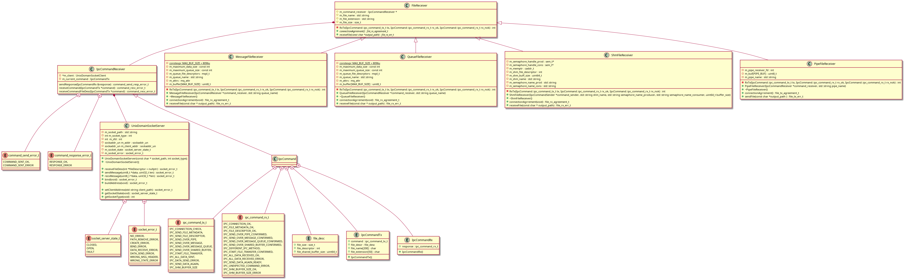
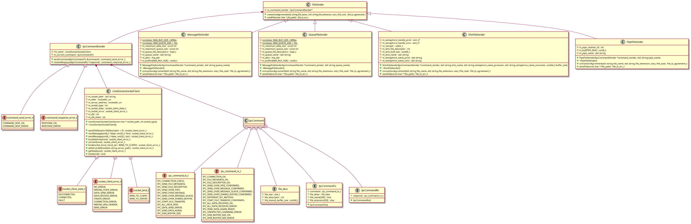

# Description

This project is about copying a file from one place to another. Yes, that's all :). 

There are two programs:
- ipc_receiver - receives data over given IPC mechanism and stores file in given place
- ipc_sendfile - sends copied file data over given IPC mechanism

# Cloning repository

To clone this repository you need to install git client

[Git download](https://git-scm.com/downloads)

then you can clone it over https by hitting:

```
git clone https://github.com/RafalTomczykUnikie/ipc_programs.git
```
or over ssh (**remember to add SSH key to your github account**):
```
git clone git@github.com:RafalTomczykUnikie/ipc_programs.git
```

# Setup

You can find script in repo that automates environment setup:

```bash
./setup environment.sh
```

# Building

To build with always cleaning everything:
```bash
./build_and_run_tests.sh
```
or without cleaning:
```bash
./build_and_run_tests_without_clean.sh
```

you can find programs in **output** directory

```
output/_____
            |_ ipc_receiver
            |_ ipc_sender
```

# Usage

To copy file with given programs you have to invoke both programs from command line. Execution order does not matter:

- **sender**:
```bash
ipc_sender -/--ipc_method -f [file_name]
```
- **receiver**:
```bash
ipc_receiver -/--ipc_method -f [file_name]
```

For **help** you can hit:

- **sender**:
```bash
ipc_sender -h/--help
```
- **receiver**:
```bash
ipc_receiver -h/--help
```


### You can choose from 4 ipc methods:

- **pipe**:
```bash
ipc_receiver -p/--pipe -f file_name
ipc_sender -p/--pipe -f file_name
```


- **queue**:
```bash
ipc_receiver -q/--queue -f file_name
ipc_sender -q/--queue -f file_name
```


- **messages**:
```bash
ipc_receiver -m/--message -f file_name
ipc_sender -m/--message -f file_name

```

- **shared memory**:
```bash
ipc_receiver -s/--shm buffer_size -f file_name
ipc_sender -s/--shm buffer_size -f file_name
```


# Software design

### Design of the receiver part of ipc library (class diagram)




### Design of the sender part of ipc library (class diagram)


